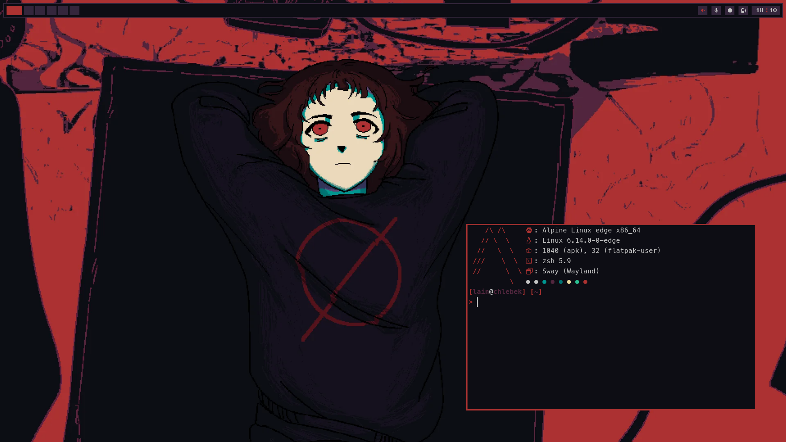
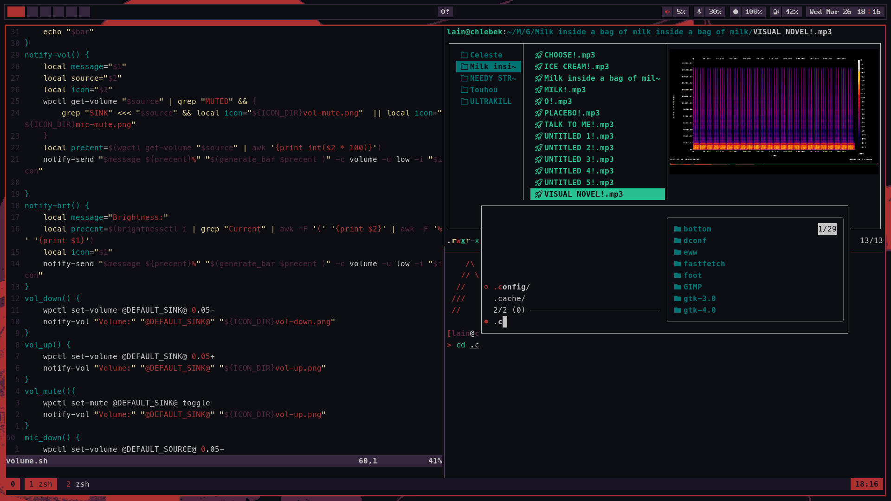

<div align="center">
<h1>milk outside a bag of milk outside a bag of milk rice</h1>
</div>

<div align="center">


</div>

## Screenshots
 
 
 
 

<details>
<summary><h2>Stuff i use</h2></summary>

- Window Manager - [Sway](https://swaywm.org/)
- user service supervisor - [superd](https://sr.ht/~craftyguy/superd/)
- panel - [eww](https://github.com/elkowar/eww)
- launcher - [tofi](https://github.com/philj56/tofi)
- shell - [zsh](https://zsh.org)
- terminal - [foot](https://codeberg.org/dnkl/foot)
- file manager - [lf](https://github.com/gokcehan/lf)
- browser - [Zen](https://zen-browser.app)
- music player - [kew](https://github.com/ravachol/kew)
- wallpapers - [Here :3](https://github.com/EC2854/wallpapers/tree/main/milk)
- font - [BigBlueTerm Nerd Font](https://github.com/ryanoasis/nerd-fonts/releases/latest/download/bigblueterminal.tar.xz)
- Terminal font - [Meslo LGL Nerd Font](https://github.com/ryanoasis/nerd-fonts/releases/latest/download/Meslo.tar.xz)

</details>

## Installation
script for this branch is untested so it will probably fail. :P
``` sh
git clone https://github.com/EC2854/dotfiles && cd dotfiles && git checkout milk && ./install.sh
```


## Thank You

<a href="https://star-history.com/#EC2854/dotfiles&Date">
    <picture>
        <source media="(prefers-color-scheme: dark)" srcset="https://api.star-history.com/svg?repos=EC2854/dotfiles&type=Date&theme=dark" />
        <source media="(prefers-color-scheme: light)" srcset="https://api.star-history.com/svg?repos=EC2854/dotfiles&type=Date" />
        
    </picture>
</a>

> Made with <3 by [Ewa (EC2854)](https://github.com/EC2854)
